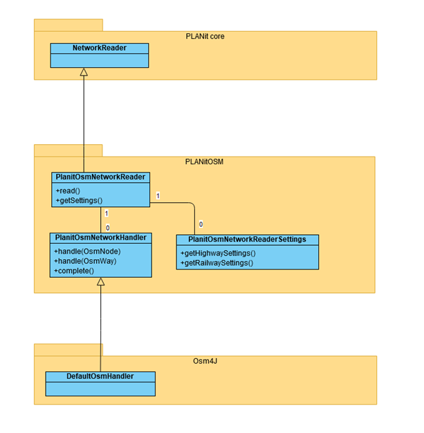
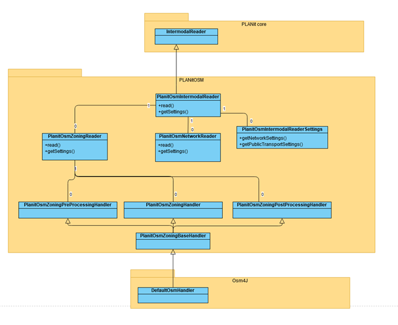

# Introduction

PLANitOSM provides two readers:

* [Network reader](#planitosmnetworkreader) for road and rail
* [Intermodal reader](#planitosmintermodalreader), that supplements the network reader with public transport infrastructure (not lines, services)

In this readme we provide a quick overview of the class structure and design of these readers. Both reader utilise  OSM4J to do the low level parsing of OSM entities (nodes, ways, relations), by implementing the respective callbacks via a handler class. These handlers are internal to the readers, so the user will not see them.

All readers derive from the PLANit interface NetworkReader, IntermodalReader, respectively. These interfaces only dictate the type the reader returns and the way a user can access the configuration options (via a getSettings() method). The main benefit of having this structure is that the readers are compatible with the PLANit converters that allow you to convert from one format (OSM) into another (X,Y,Z) via a writer that also derives from the same collection of interfaces (NetworkWriter, IntermodalWriter etc.).

## PlanitOsmNetworkReader

The reader has a `PlanitOsmNetworkReaderHandler` internally that derives from the OSM4J `DefaultHandler` (see image). It overrides the `handle(OsmWay)` and `handle(OsmNode)` methods that are used to feed the handler with the parsed OSMEntities for nodes and ways. The network reader will then in turn attempt to parse the nodes and ways based on the configuration settings the user provided. These are accessed by the using via the `getSettings()` method, which for this reader will return a `PlanitOsmNetworkReaderSettings` instance.

The settings are split into different categories some of which have their own settings. For example all the configuration regarding the parsing of OSM ways with the key tag `highway=` are dealt with with the `PlanitOsmHighwaySettings` class, accessible via `getSettings().getHighwaySettings()`. In case the user has activated the railway parser, then the settings pertaining to all OSM ways with key `railway=` are accessible via `getSettings().getRailwaySettings()`. 

### General parsing procedure
The parser adopts the following strategy: 

0) Initialise the PLANit in memory network to populate using the default/configuration of the user. This includes the activated modes, highway and railway types, and the default link segment types that are mapped to these OSM types.
1) Parse and store **all nodes in memory**. While this inflates memory usage since not all nodes are in fact part of roads and not all roads are parsed, it ensures that we can always construct all our roads within a single pass of the OSM file, speeding up the parsing process. 
2) Then parse all OSM ways as is - even if they are not topologically sorrect, meaning that they might intersect with other OSM ways. 
3) After parsing the roads, we then identify issues regarding the topological validity of the parsed network and break links where needed, construct our roundabouts, and possibly remove any dangling subnetworks (if so configured).

### Parsing OSM nodes

- All nodes are parsed and locally stored by their OSM id
- We track the bounding box of the file dynamically based on the OSM node geo information

### Parsing OSM ways basic

OSM ways are first parsed as is, before we consider modifying them in case of issues regarding topology, or other aspects that need addressing. However, we do not (yet) parse an OSM way when:

* It is not an activated road or rail based piece of infrastructure
* It is a circular way (these are handled separately afterwards and stored in memory for the time being)

When an OSM way is deemed eligible for parsing it is extracted in its entirety. There are two main aspects to this extraction:

* Identifying the link segment type compatible with the OSM way's type and mode access tagging (`extractLinkSegmentTypes()`)
* Identifying the link(segment) properties such as geometry and other tags (`layerHandler.extractPartialOsmWay()`)

The link segment type is determined in two steps: 1) collect the default type based on the OSM road/rail type (`getDefaultLinkSegmentTypeByOsmWayType()`, 2) modify it based on the specific tagging on the OSM way (`updatedLinkSegmentTypeBasedOnOsmWay()`). The former is straightforward, but the latter requires in-depth analysis of the tags used to identify what tagging scheme is applied and then extract the mode access. In case a new unique combination of properties is found, a new link segment type is registered on PLANit and returned. Depending on whether or not the OSM way is one way or not, the result are at most two link segment types (one per direction), which are then used to populate the link segment(s) and the link. 

> In PLANit a link is not directional, it has link segments that are directional. so a link at most has two link segments.

### Parsing circular ways

Circular ways are a special case. they are not parsed directly because in PLANit a link cannot start and end in the same location. Therefore, any circular OSM way must be split in at least two links by definition to be viable. This processing is done after the parsing of the osm ways (`processCircularWays()`). The circular way must at least have one circular section, but it is possible it has multiple and these can be preceded and succeeded with non-circular sections. Therefore, this is explicitly catered for when parsing, allowing even the most complex of OSM ways that self-intersect and contain loops (`handleRawCircularWay()`). For each circular section PLANit attempts to find locations on the OSM way where it intersects with other - already parsed - OSM ways, as these are candidates where to split the OSM way since it represents a point of access/egress of the roundabout. If no such point can be found, PLANit will make a choice on where to split the circular way.

### Breaking Links

Similar to processing circular ways, OSM ways that are parsed but intersect internally with other parsed OSM ways, need to be broken in these locations to create a topologically sound network that can be used for traffic assignment (and it is just generally a better way of designing networks). Therefore, PLANit identifies all links that need to be broken and does so (`breakLinksWithInternalConnections()`). PLANit itself provides functionality to break links on graphs/networks and the OSM reader utilises this functionality provided in the various modifiers (`graphModifier.breakEdgesAt()`).

The OSM reader keeps track of which links have been broken as well during this process because it is likely that some links are broken multiple times in which case we must be able to identify which of the already broken links is the *only* link that needs to be broken again. IF we would take this additional step, all the broken links, or the wrong broken link might be broken again, which leads to incorrect networks.

Also, we providean additional listener to this action, namely the `SyncDirectedEdgeXmlIdsToInternalIdOnBreakEdge` listener. This ensures that the xml id of the links is synced with the internal id that is guaranteed to remain unique even during the breaking of links.

> Note this relies on the fact that the OSM reader initially syncs the xml ids to the internal ids, otherwise this does not work.

> There are implementations to break links both for a graph and directed graph, the latter also supports the breaking of edge segments (link segments). Our networks hold a directed graph internally with nodes, links, and link segments as their elements. Hence, breaking links will eventually end up invoking the modification on a directed graph implementation

### PLANit infrastructure layers

PLANit in principle supports multiple infrastructure layers, where one or more modes are exclusively tied to a layer. The OSM reader does support this as well in prinnciple with the functionality always being specific to the layer at hand. Practically though no other implementation exists than one with only a single layer containing all modes. so while most functionality is layer specific in the reader, in practice we only even user a single layer and it has not yet been tested in any other situation.

## PlanitOsmIntermodalReader

